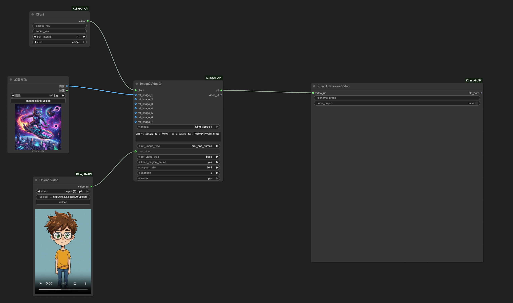

# ComfyUI-KLingAI-Node

这是一个用于 ComfyUI 的自定义节点，允许你在 ComfyUI 中直接使用可灵 AI API。可灵 AI API 基于 [KLing AI](https://app.klingai.com/global/dev/document-api/quickStart/productIntroduction/overview) 构建。更多信息请参阅 [可灵 AI API 文档](https://docs.qingque.cn/d/home/eZQArO-0RpjbQMpf5DPa-w8Rp?identityId=1oEER8VjdS8#section=h.wxrj3t7cbpg3)。

## 使用要求
使用此节点前，你需要拥有 [可灵 AI API 密钥](https://docs.qingque.cn/d/home/eZQA6m4cRjTB1BBiE5eJ4lyvL?identityId=1oEER8VjdS8)。

## 安装

### 手动安装

1. 导航到 `ComfyUI/custom_nodes` 目录。

2. 克隆此仓库：`git clone https://github.com/zhangqitao1/comfyui-keling-node`
  
3. 安装依赖：
  - Windows (ComfyUI portable)：`python -m pip install -r ComfyUI\custom_nodes\comfyui-keling-node\requirements.txt`
  - Linux 或 MacOS：`cd comfyui-keling-node && pip install -r requirements.txt`

4. 如果你不想暴露你的密钥，可以将其添加到 `config.ini` 文件中，并在节点中保持为空。

5. 启动 ComfyUI，开始使用可灵 AI API 节点！

## 节点说明

### Client（客户端）

此节点用于创建可灵 AI 客户端。

### Image Generator（图像生成器）

此节点用于根据文本提示生成图像。

  

### Text2Video（文生视频）

此节点用于根据文本提示生成视频。

  

### Image2Video（图生视频）

此节点用于根据图像生成视频。

  

### Text2VideoO1 / Image2VideoO1

支持 KLing AI O1 功能的视频生成节点，提供更强大的视频生成能力和更丰富的参数控制。

  

**主要特性：**

- **Text2VideoO1**: 基于文本提示生成视频，支持更高级的参数配置
- **Image2VideoO1**: 基于图像生成视频，支持多图片参考和视频参考

**图生视频参数说明：**

- `ref_image`: 支持选择最多 7 张参考图片
- `ref_image_type`: 参考图片类型
  - `first_end_frames`: 首尾帧模式 - 第一张图作为首帧，第二张图作为尾帧
  - `image_reference`: 图片参考模式 - 使用图片作为生成参考
- `ref_video_type`: 参考视频类型
  - `base`: 待编辑视频
  - `feature`: 特征参考视频
- `keep_original_sound`: 是否保留原始音频
  - `yes`: 保留原声
  - `no`: 不保留原声

### Upload Video（视频上传）

视频上传节点，用于上传本地视频文件并获取 URL，可将生成的 URL 传递给可灵进行参考视频生成。

**注意事项：**
- 上传服务地址：`http://0.0.0.0:8509/upload`
- 此上传地址可更换为自己的地址，因为 O1 要求参考视频的参数是 URL。

### Kolors Virtual Try-On（可图虚拟试穿）

此节点用于展示虚拟试穿效果。

  

### Video Extend（视频延长）

此节点用于延长视频时长。

  

### Lip Sync（口型同步）

此节点用于生成口型同步视频。

  

### Effects（视频特效）

此节点可根据 effect_scene 参数实现不同的视频特效。

  

### ImageExpander（图像扩展）

此节点用于扩展图像。

  

### Video2AudioNode（视频转音频）

此节点用于从视频生成音频。

  

### TextToAudioNode（文本转音频）

此节点用于根据文本生成音频。

  

## 定价

关于定价信息，请查看 [可灵 AI 定价](https://klingai.com/dev-center)。
